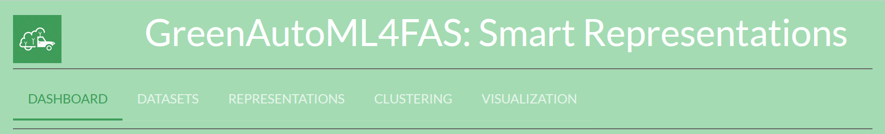
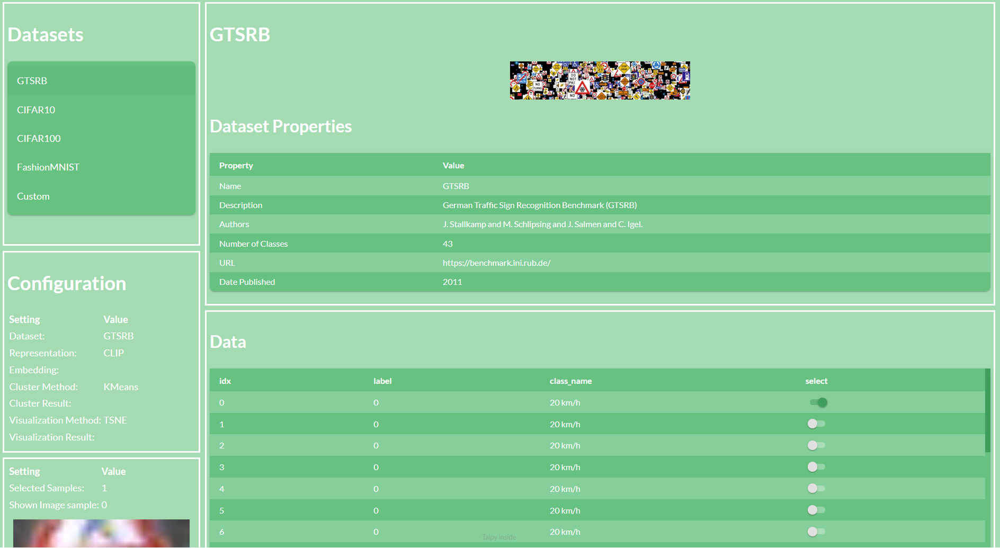
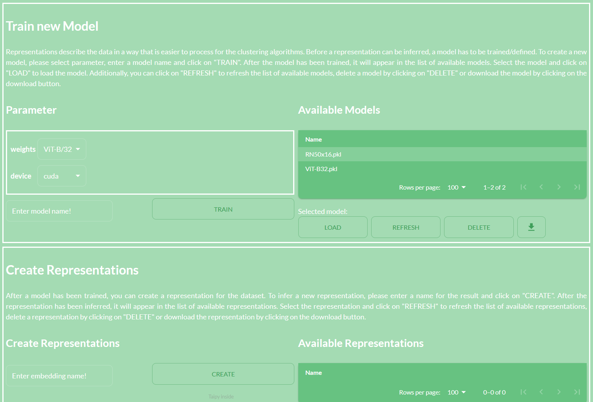
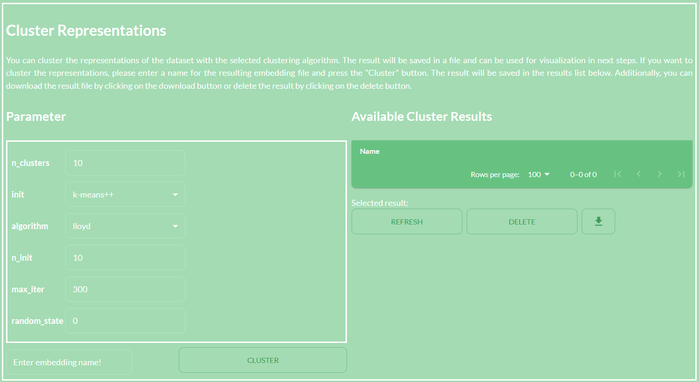
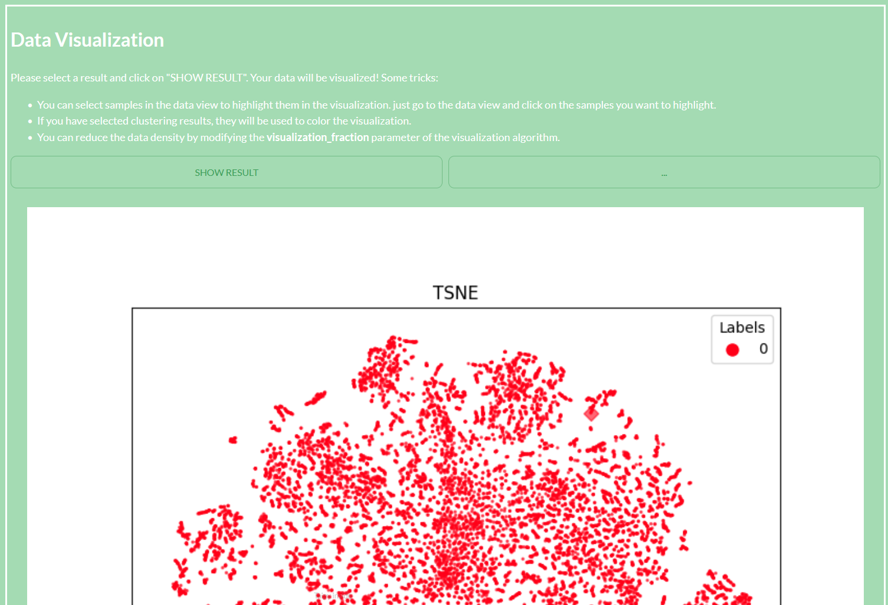

<p align="center">
    
</p>

# Smart Representations

Welcome to the **Smart Representations** demonstrator of the GreenAutoML4FAS
project. The aim of this demonstrator is to show our workflow during the
data acquisition and preprocessing phase. It provides a tool to encode, cluster,
and visualize data. The demonstrator is designed to be user-friendly and
intuitive. It is divided into three main parts:

1. **Representations**: In this part, you can encode your data into different
   representations. The demonstrator provides a variety of pretrained and
   trainable methods to encode your data. You can choose between different methods and adjust the
   hyperparameters.

2. **Clustering**: In this part, you can cluster your data with different
   clustering algorithms. The demonstrator provides a variety of clustering
   algorithms to cluster your data. You can choose between different clustering
   algorithms and adjust the hyperparameters of the clustering algorithms.

3. **Visualization**: In this part, you can visualize your data in different
   ways. The demonstrator provides a variety of visualization methods to
   visualize your data. You can choose between different visualization methods
   and adjust the hyperparameters of the visualization methods.

The demonstrator is implemented in python in a Taipy http server. It can be
started as shown in the end of the installation section. The demonstrator is
then available at [http://localhost:5000](http://localhost:5000). A detailed
description of the code methods and how to use custom data is given in the
following sections.

## Install

The repository is tested with Python 3.10.11.
We recommend to install CUDA to speed up the training and inference of the models.
After you installed Python, you can install the required packages with the
following commands:

```shell
pip install numpy matplotlib pandas seaborn taipy scikit-learn opencv-python
pip install service_identity scikit-learn-extra python-magic python-magic-bin
pip install torch torchvision
pip install git+https://github.com/openai/CLIP.git
pip install git+https://github.com/m-schier/cms
```

Then clone the repository:

```shell    
git clone https://github.com/GreenAutoML4FAS/SmartRepresentations
```

and start the demonstrator with the following commands:

```shell
cd SmartRepresentations/src
export PYTHONPATH=$PYTHONPATH:$PWD
python frontend/start_server.py
```

You can now open the demonstrator in your browser at [http://localhost:5000](http://localhost:5000).

## How to use

To use the demonstrator, you can follow the steps. The demonstrator is divided
into three main parts: Representations, Clustering, and Visualization. You can
navigate between the parts by clicking on the respective button in the
navigation bar.

### Datasets

<p align="center">
    
</p>

First, you can choose a dataset from the dropdown menu. The demonstrator
provides a variety of datasets to choose from. To load a dataset, click on the
dataset name in the dropdown menu. The dataset will be loaded and a table with
data samples will be displayed. If you click on a sample in the table, the
sample will be displayed in the image viewer in the lower left corner.
Moreover, the currently selected dataset name will be displayed in the
**Configuration** section.

By default, there are some toy datasets available. You can also use your own data.
To use your own data, create a directory at location *DIR_PATH* and export the
environment variable *CUSTOM_DATASET_PATH=DIR_PATH* before starting the server.
The directory *DIR_PATH* should be structured as follows:

```
DIR_PATH
├── images
│   ├── image1.jpg
│   ├── image2.jpg
│   └── ...
└── labels.csv
```

The *images* directory contains the images of the dataset. The *labels.csv* file
contains the labels of the dataset. The *labels.csv* file should have the
following structure:

```
image,label,property1,property2,...
image1.jpg,label1,property1_value,property2_value,...
image2.jpg,label2,property1_value,property2_value,...
...
```

Where *image* is the name of the image file, *label* is the label of the image,
and *property1*, *property2*, ... are additional properties of the image that can
be useful in some algorithms.

### Representations

<p align="center">
    
</p>

After you have chosen a dataset, you can encode the data into different
representations. The demonstrator provides a variety of pretrained and trainable
methods to encode your data. First, select a representation method from the
dropdown menu. Depending on the selected method, you can adjust the hyperparameters
of the method. After you have adjusted the hyperparameters, you need to train the
method by selecting a model name and clicking on the **Train** button.
The method will be trained on the dataset and the trained file will be displayed in
the *Available Models* table. You can then select the trained model from the
dropdown menu and load the model by clicking on the **Load** button. You can also
delete the model by clicking on the **Delete** button or download the model by
clicking on the **Download** button. **Note**: All models need to be trained before
they can be loaded. This is also true for pretrained models which will then just be
copied.

After you have trained and loaded a model, you can encode the data in the
*Create Representation* section. Select a name for the resulting embedding file
and click on the **Create** button. The data will be encoded and the resulting
embedding file will be displayed in the *Available Representations* table. You can
then select the embedding file from the dropdown menu. You can also delete the embedding file by
clicking on the **Delete** button or download the embedding file by clicking on
the **Download** button.

The currently selected embedding file will be displayed in the *Configuration*
section. Depending on the method, training and inference can take some time.
You can check the state in the *Running Jobs* section in the dashboard.

### Clustering

<p align="center">
    
</p>

After you have encoded the data into different representations, you can cluster
the data with different clustering algorithms. The demonstrator provides a
variety of clustering algorithms to cluster your data. First, select a clustering
algorithm from the dropdown menu. Depending on the selected algorithm, you can
adjust the hyperparameters of the algorithm. After you have adjusted the
hyperparameters, you need to type in the name of the file to store the clustering
results and click on the **Cluster** button. The data will be clustered and the
clustering results will be displayed in the *Available Cluster Results* table. You can
then select the clustering results from the dropdown menu. You can also delete
the clustering results by clicking on the **Delete** button or download the
clustering results by clicking on the **Download** button.

The currently selected clustering results will be displayed in the *Configuration*
section. You can see the state of the clustering in the *Running Jobs* section in
the dashboard.

### Visualization

<p align="center">
    
</p>

Finally, after you have clustered the data, you can visualize the data in
different ways. The demonstrator provides a variety of visualization methods to
visualize your data. First, select a visualization method from the dropdown menu.
Depending on the selected method, you can adjust the hyperparameters of the
method. After you have adjusted the hyperparameters, you need to type in the name
of the file to store the visualization results and click on the **Visualize**
button. The data will be processed to be visualized, and the preprocessing results
will be displayed in the *Available Results* table. You can then select the
preprocessing results from the dropdown menu. You can also delete the preprocessing
results by clicking on the **Delete** button or download the preprocessing results
by clicking on the **Download** button.

After proprocessing, you can visualize the data by clicking on the **Show Results**
button. The visualization plotted by matplotlib will be displayed in the *Data Visualization*
section.
There are some ways to interact and improve with the visualization.

- You can select samples in the *Datasets* view to highlight them in the visualization. Just go to the data view and click on the samples you want to highlight.
- If you have selected clustering results, they will be used to color the visualization.
- You can reduce the data density by modifying the **visualization_fraction** parameter of the visualization algorithm, resulting in a better visualization.

The currently selected preprocessing results will be displayed in the *Configuration*
section. You can see the state of the visualization in the *Running Jobs* section in
the dashboard.

## Citation

This work implements some methods to encode, cluster, and visualize data. Most
of the methods are commonly known and used in the field of machine learning.
All relevant citations are given in the respective html pages of the demonstrator.

However, two methods mostly unknown in the community of machine
learning but highly relevant in this repository.
Therefore, we want to mention them explicitly here:

```latex
@inproceedings{schier2022constrained,
    title={Constrained Mean Shift Clustering},
    author={Schier, Maximilian and Reinders, Christoph and Rosenhahn, Bodo},
    booktitle={Proceedings of the 2022 SIAM International Conference on Data Mining (SDM)},
    year={2022},
    organization={SIAM}
}
```

```latex
@inproceedings { RudWan2019a,
    author = {Marco Rudolph and Bastian Wandt and Bodo Rosenhahn},
    title = {Structuring Autoencoders},
    booktitle = {Third International Workshop on “Robust Subspace Learning and Applications in Computer Vision” (ICCV)},
    year = {2019},
    url = {https://arxiv.org/abs/1908.02626},
    month = aug
}
```

---

## License Notice

The **content of this repository** is licensed under the [BSD 3-Clause](https://opensource.org/license/bsd-3-clause).

## Acknowledgement

This work was partially supported by the Federal Ministry of the Environment,
Nature
Conservation, Nuclear Safety and Consumer Protection, Germany under the project
**GreenAutoML4FAS** (grant no. 67KI32007A).

The work was done at the Leibniz University Hannover and published at the
*Workshop on Resource Efficient Deep Learning for Computer Vision* at the
International Conference on Computer Vision 2023.

<p align="center">
     
    
     
</p>
